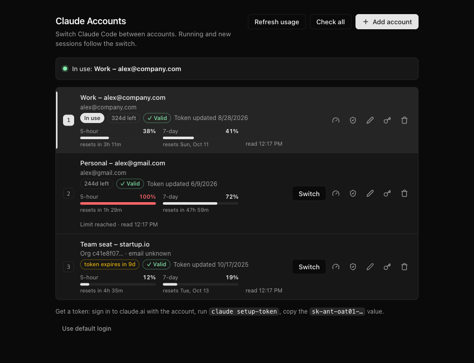
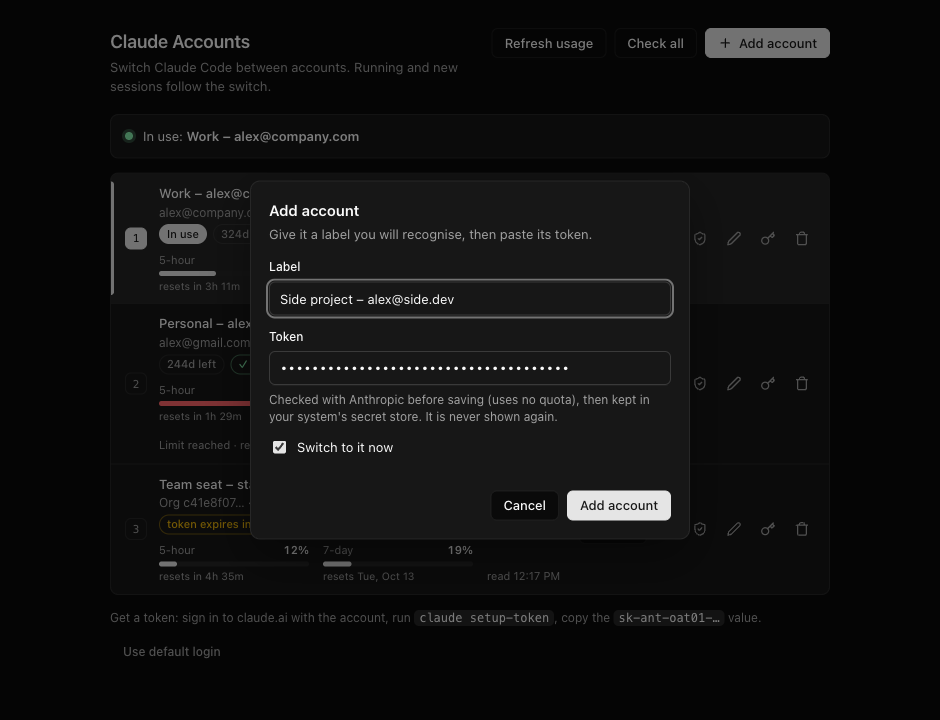
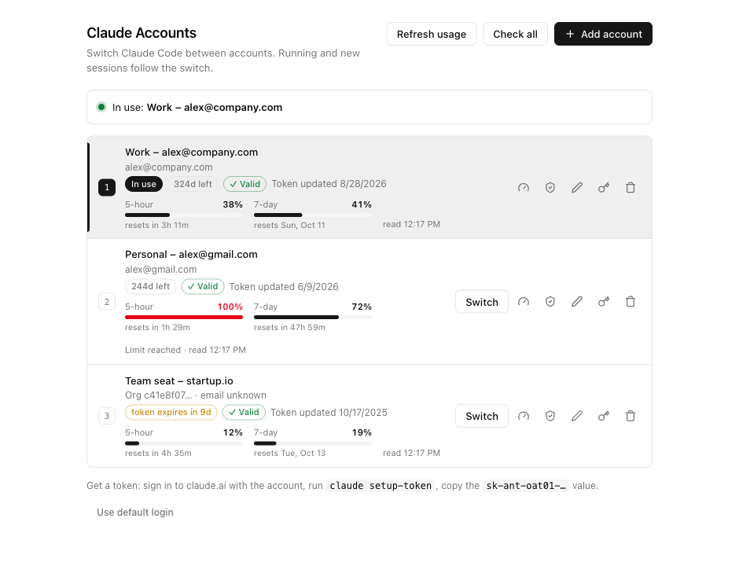
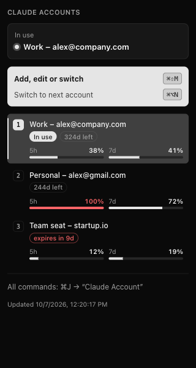

# Claude Accounts — Orca plugin

Switch [Claude Code](https://code.claude.com) between several Claude accounts from
inside [Orca](https://github.com/stablyai/orca) — work, personal, team seats — without
logging in and out. Each account uses a one-year token from `claude setup-token`.



- **Switch in one keystroke**; running Claude Code sessions follow the switch.
- **Usage per account**: 5-hour and 7-day usage with reset times, shown by default.
- **Token check** with Anthropic before saving (uses no quota).
- **Secure storage**: macOS Keychain, Windows DPAPI, Linux keyring.
- Looks like Orca: the page uses the design tokens of your installed Orca and follows your theme.

> Experimental: built on Orca's plugin API v1 (Orca 1.4.x), which is itself experimental.
> macOS is tested daily; Linux storage is tested; Windows is untested — reports welcome.

---

## Contents

1. [Before you start](#1-before-you-start)
2. [Get a one-year token for each account](#2-get-a-one-year-token-for-each-account)
3. [Install the plugin in Orca](#3-install-the-plugin-in-orca)
4. [Open Claude Accounts](#4-open-claude-accounts)
5. [Add your accounts](#5-add-your-accounts)
6. [Switch accounts and watch usage](#6-switch-accounts-and-watch-usage)
7. [The sidebar panel](#7-the-sidebar-panel)
8. [Command line](#8-command-line-optional)
9. [Troubleshooting](#troubleshooting)
10. [How it works](#how-it-works) · [Where tokens are stored](#where-tokens-are-stored) · [Notes](#notes)

---

## 1. Before you start

You need:

- [Orca](https://github.com/stablyai/orca) **1.4 or newer** (macOS, Windows or Linux)
- **Claude Code** installed (`claude` on your PATH)
- A **Claude subscription** (Pro, Max, Team or Enterprise) for each account you want to add
- Linux only: `secret-tool` (package `libsecret-tools` or `libsecret`) and a running
  keyring such as GNOME Keyring or KWallet. Without one, tokens fall back to a
  mode-600 file and the page warns you.

## 2. Get a one-year token for each account

`claude setup-token` creates a long-lived (one-year) token for the Claude account
that is **signed in on claude.ai in your browser**
([Claude Code docs](https://code.claude.com/docs/en/authentication)).

For **each** account:

1. In your browser, sign in to [claude.ai](https://claude.ai) **with that account**.
   Tip: use a private/incognito window, or sign out first, so you don't authorize
   the wrong account.
2. In a terminal, run:

   ```sh
   claude setup-token
   ```

3. Approve the request in the browser page that opens.
4. Back in the terminal, copy the printed token. It starts with `sk-ant-oat01-`.

Keep the token private — it gives access to that account's Claude usage. You will
paste it into the plugin in step 5; the plugin stores it securely and never shows it again.

## 3. Install the plugin in Orca

Choose **one** of the two options.

### Option A — install from Git (simplest)

1. In Orca, open **Settings → Plugins**.
2. Choose to install a plugin from **Git** and enter this URL **including the `#` part**:

   ```
   https://github.com/baroned1707/orca-claude-accounts.git#v0.11.3
   ```

   The `#v0.11.3` pins the exact release; Orca requires a tag or commit after `#`.
3. Enable **Claude Accounts** and approve its permission (it only shows notifications).

### Option B — developer path (live sidebar panel, easy updates)

```sh
git clone --branch v0.11.3 https://github.com/baroned1707/orca-claude-accounts.git
cd orca-claude-accounts
npm link        # optional: adds the `claude-accounts` command (Node.js 18+)
```

Then in Orca: **Settings → Plugins → Developer plugin paths** → add the cloned
folder, enable **Claude Accounts** and approve its permission.

Option B is needed for a sidebar panel that updates live (see [step 7](#7-the-sidebar-panel)).
To upgrade later: `git fetch --tags && git checkout v<new version>`.

> Orca asks you to approve the plugin again whenever its keyboard shortcuts change
> (for example after an upgrade). Until you do, commands report
> *"Could not run the plugin command"*.

## 4. Open Claude Accounts

Any of these opens the **Manage accounts** page as a tab inside Orca:

| How | macOS | Windows / Linux |
| --- | --- | --- |
| Keyboard shortcut | `⌘⇧M` | `Ctrl+Shift+M` |
| Command palette | `⌘J` → type **Claude Account: Manage Accounts…** | `Ctrl+Shift+J` → same |

Orca needs an open worktree to show the tab; otherwise the page opens in your
default browser. `⌘⇧M` is also Orca's default for *New markdown tab* — if that is
what opens, change one of the two in **Settings → Shortcuts**.

## 5. Add your accounts

Click **Add account**, give it a label you will recognise (for example
"Work – alex@company.com"), paste the token from step 2, and keep
**Switch to it now** ticked if you want to use it right away.



Before saving, the plugin checks the token with Anthropic (no quota used):

- a **rejected** token is not saved, and the dialog shows why;
- a token that is **already saved** is refused;
- a token from the **same organization** as an existing account is saved with a
  note — normal on Team/Enterprise plans, whose members share one organization.

Repeat for every account.

## 6. Switch accounts and watch usage



- **In use** — the account Claude Code uses now: shown at the top, marked with an
  accent bar, a filled slot number and an *In use* badge.
- **Switch** — makes that account the one in use. New *and already running* Claude
  Code sessions use it from their next request; no restart needed.
- **Usage** — 5-hour and 7-day bars with the time until they reset. Amber means
  80 % or more, red means the limit is reached (*Limit reached*). Usage is read when
  the page opens and every 5 minutes while it is visible.
- **Badges** — *✓ Valid* / *✕ Invalid* from the last token check, days left on the
  one-year token (amber from 14 days), and the account's email when it is known.
- **Row buttons** — refresh usage, check token, edit label, update token, remove.
- **Header buttons** — *Refresh usage* and *Check all* for every account at once.
- **Use default login** — removes the token; Claude Code goes back to your normal `/login` session.

Faster switching without opening the page:

| Action | macOS | Windows / Linux |
| --- | --- | --- |
| Switch to the next account | `⌘⌥N` | `Ctrl+Alt+N` |
| Use account 1…5 | `⌘J` → **Claude Account: Use Slot N** | `Ctrl+Shift+J` → same |
| List accounts in a notification | `⌘J` → **Claude Account: Show Accounts** | `Ctrl+Shift+J` → same |

When a token is about to expire, create a new one (step 2) and use **Update token**
on that account.

## 7. The sidebar panel

Open Orca's right sidebar (`⌘L` / `Ctrl+L`) and click the **bot** icon:



It shows the account in use, every account with its token age and last usage, and
the shortcuts. The panel is **read-only** — Orca doesn't let plugin panels run
commands — so use `⌘⇧M` to change anything.

It updates live only with the **developer path** install (Option B): the plugin
refreshes it by rewriting `panel.html` in its folder, which Orca can't do for a
Git-installed (content-locked) copy. It never contains tokens or emails.

## 8. Command line (optional)

After `npm link` (Option B):

```sh
claude-accounts                        # list accounts (● = in use) with last usage
claude-accounts ui                     # open the Manage accounts page
claude-accounts add "Work – me@co.com" # paste the token at the hidden prompt (or: pbpaste | …)
claude-accounts use 2                  # switch by slot number or label
claude-accounts next                   # switch to the next account
claude-accounts off                    # use your normal /login session
claude-accounts usage [slot]           # 5-hour / 7-day usage
claude-accounts check [slot]           # validate tokens (no quota)
claude-accounts token 2                # replace a token
claude-accounts label 2 "New label"
claude-accounts rm 2
```

---

## Troubleshooting

| Problem | What to do |
| --- | --- |
| *Could not run the plugin command* | **Settings → Plugins → Claude Accounts**: approve the plugin again (needed after shortcut changes), then reload it. |
| `⌘⇧M` opens a markdown tab | Orca's *New markdown tab* uses the same key. Change one of them in **Settings → Shortcuts**. |
| The page opened in my web browser | Orca needs an open worktree to show it as a tab. |
| *The account manager is not running* | It stops after 30 idle minutes. Press `⌘⇧M` again. |
| *token rejected by Anthropic* | The token is wrong, revoked or expired. Create a new one (step 2). |
| *this token is already saved as …* | You pasted a token that is already stored — check your clipboard holds the new token. |
| *same organization as …* | Fine on Team/Enterprise plans. Otherwise you probably ran `claude setup-token` while the browser was signed in to that other account. |
| *⚠ Stored in a plain file* (Linux) | No keyring was available. Start/unlock GNOME Keyring or KWallet, then **Update token** to move it into the keyring. |
| No email shown | setup-token tokens can't read the profile. The email appears only for accounts also signed in on this computer with `/login`; use a descriptive label instead. |

---

## How it works

Switching writes the selected token to `env.CLAUDE_CODE_OAUTH_TOKEN` in
`~/.claude/settings.json`. Claude Code reads that file at start-up **and reloads
it while running**, so new and running sessions use the selected account
(verified with Claude Code 2.1.292). All sessions share one account at a time.

- **Token check** — `GET /v1/models` with the token: needs a working token, runs no
  model, uses no quota.
- **Usage** — setup-token tokens can't call Anthropic's usage API (it needs the
  `user:profile` scope), so each reading sends the smallest model request (Haiku,
  1 output token) and reads the `anthropic-ratelimit-unified-*` headers, the same
  numbers Claude Code uses. Each reading spends a tiny amount of usage.
- **Email** — the plugin records each token's organization id and shows the email
  when it matches an account signed in on this computer with `/login`.
- **Manage page** — plugin panels can't exchange data with the plugin, so the page
  is served by a small local server running as its own process: bound to
  `127.0.0.1`, behind a random 256-bit URL secret, `Host`-checked, JSON-only writes
  with a custom header, never returns tokens, exits after 30 idle minutes.
- **Theme** — read at runtime from the installed Orca's `resources/app.asar`, so it
  matches your Orca version, theme and font; system colors if Orca can't be read.

## Where tokens are stored

| Platform | Every account's token | How |
| --- | --- | --- |
| macOS | login Keychain, service `orca-claude-accounts` | `security`, token passed on stdin |
| Windows | `%USERPROFILE%\AppData\Roaming\orca-claude-accounts\tokens\<id>.dpapi` | encrypted with DPAPI for your Windows user |
| Linux | Secret Service keyring (GNOME Keyring, KWallet…) | `secret-tool`, token passed on stdin |
| Linux, no keyring | `~/.config/orca-claude-accounts/tokens/<id>` | plain file, mode 600, flagged in the UI |

Tokens never appear in process arguments, the plugin folder, the sidebar panel or
the page's responses.

| Other file | Contents |
| --- | --- |
| `~/.claude/settings.json` → `env.CLAUDE_CODE_OAUTH_TOKEN` | the token of the account **in use**, in plain text — that is where Claude Code reads it |
| `accounts.json` in the data folder¹ | labels, dates, last check, usage — no tokens |
| `server.json` in the data folder¹ | URL of the running Manage page (mode 600) |

¹ `~/.config/orca-claude-accounts` on macOS/Linux and
`%USERPROFILE%\AppData\Roaming\orca-claude-accounts` on Windows — fixed paths,
because Orca starts plugins without `XDG_CONFIG_HOME`/`APPDATA`.

## Notes

- setup-token tokens are inference-only: features that need a full login (for
  example Remote Control) don't work while a token is in use.
- Don't also pick a managed Claude account in Orca's own account switcher: Orca then
  points Claude Code at a different config folder and ignores this token.
- Remove any `CLAUDE_CODE_OAUTH_TOKEN` exported in your shell profile.
- Desktop notifications from the Manage page use `osascript` (macOS) and
  `notify-send` (Linux); on Windows the page shows its own messages.
- Screenshots use made-up demo accounts.

## License

[MIT](LICENSE)
